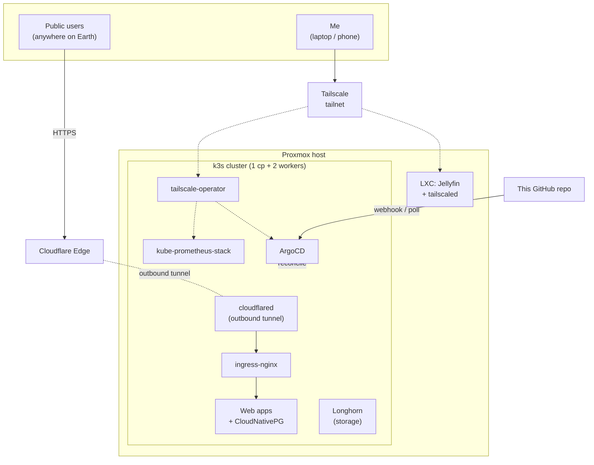

# Homelab

A fully GitOps-driven homelab running on a single Proxmox host. Three Ubuntu VMs are provisioned by Terraform, joined into a k3s cluster by Ansible, and from that point on every workload — ingress, storage, databases, monitoring, the Cloudflare Tunnel, the Tailscale operator, and the applications themselves — is reconciled from this repository by ArgoCD.

## Architecture

The split is deliberate. **Cloudflare Tunnel** carries traffic for anything I want the public to reach, with no port forwarding and no static IP required. **Tailscale** carries traffic for anything only I (or invited people) should reach: Jellyfin, Grafana, the ArgoCD UI, the Proxmox admin console.

To reproduce from scratch, follow the instructions in [SETUP.md](./SETUP.md).

## License

MIT — see [LICENSE](./LICENSE).
