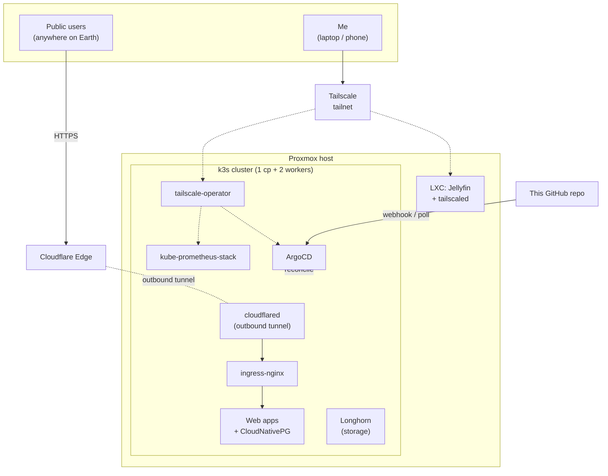

# Homelab

[](./terraform)
[](./kubernetes)
[](./kubernetes/argocd)
[](./renovate.json)
[](./LICENSE)

A fully GitOps-driven homelab running on a single Proxmox host. Three Ubuntu VMs are provisioned by Terraform, joined into a k3s cluster by Ansible, and from that point on every workload — ingress, storage, databases, monitoring, the Cloudflare Tunnel, the Tailscale operator, and the applications themselves — is reconciled from this repository by ArgoCD.

## Architecture



The split is deliberate. **Cloudflare Tunnel** carries traffic for anything I want the public to reach, with no port forwarding and no static IP required — perfect for residential ISPs and CGNAT. **Tailscale** carries traffic for anything only I (or invited people) should reach: Jellyfin, Grafana, the ArgoCD UI, the Proxmox admin console.

## What's in this repo

| Path                      | What it does                                                                 |
| ------------------------- | ---------------------------------------------------------------------------- |
| `terraform/proxmox/`      | Provisions the three Ubuntu VMs from a cloud-init template.                  |
| `terraform/cloudflare/`   | Manages the Cloudflare Tunnel and public DNS records as code.                |
| `proxmox/`                | One-time scripts for building the Ubuntu 24.04 cloud-init VM template.       |
| `ansible/`                | Bootstraps the VMs and installs k3s (server on cp-1, agents on workers).     |
| `kubernetes/bootstrap/`   | One-time imperative bits: install ArgoCD via Helm.                           |
| `kubernetes/argocd/`      | The app-of-apps. ArgoCD watches this folder; everything else flows from it.  |
| `kubernetes/infrastructure/` | Cluster services: ingress, cert-manager, Longhorn, CloudNativePG, etc.    |
| `kubernetes/apps/`        | The actual web apps and their per-app Postgres clusters.                     |
| `docs/`                   | Architecture deep-dive, runbook, and Architecture Decision Records.          |
| `.github/workflows/`      | CI: `terraform plan` on PR, lint everything, gated apply on `main`.          |

## Reproducing from zero

```bash
# 0. Tooling
brew bundle               # installs everything from Brewfile

# 1. Build the Proxmox template (one-time, on the Proxmox host)
ssh root@pve "bash -s" < proxmox/build-template.sh

# 2. Provision the VMs
cd terraform/proxmox
cp terraform.tfvars.example terraform.tfvars   # then fill it in
terraform init && terraform apply

# 3. Install k3s
cd ../..
make inventory            # builds ansible/inventory.yml from terraform output
make k3s-install

# 4. Bootstrap ArgoCD (one push, then GitOps takes over)
make argocd-bootstrap

# 5. From here on, everything is `git push`
```

See [`docs/architecture.md`](./docs/architecture.md) for the deep dive, [`docs/runbook.md`](./docs/runbook.md) for recovery procedures, and [`docs/adr/`](./docs/adr/) for the reasoning behind the choices.

## What I learned building this

> Fill in as you go. Suggested structure:
> - **Networking**: why CF Tunnel + Tailscale is a better split than either one alone.
> - **Storage**: trade-offs between Longhorn, NFS, and local PVs for a 3-node cluster.
> - **GitOps**: how `Application`-of-`Application`s removes the "who applies the first manifest" chicken-and-egg.
> - **The painful bits**: what broke, what I'd do differently next time.

## Limitations & known trade-offs

- The control plane is a single node (`cp-1`). Survives worker failure, not control-plane failure. Acceptable for a learning lab; would be 3-node HA in production.
- Backups are out of scope in v1. Longhorn snapshots run, but they're stored on the same physical host as the cluster — no off-site copy yet. Planned: nightly `pgdump` from each CloudNativePG cluster to a Backblaze B2 bucket via `mc` cronjob.
- Secrets are committed via [sealed-secrets](https://github.com/bitnami-labs/sealed-secrets). The sealing key lives in-cluster; a full cluster wipe means rotating every secret. Acceptable for homelab; would use external KMS in production.
- Cloudflare Tunnel free tier prohibits proxying large video files, so Jellyfin is intentionally **not** exposed via the tunnel — it's Tailscale-only.

## License

MIT — see [LICENSE](./LICENSE).
